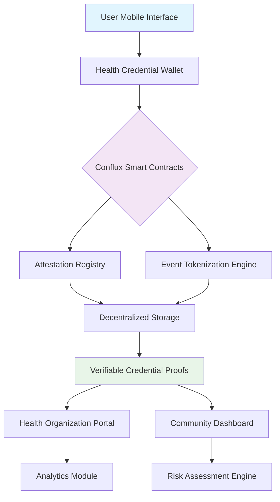

# 🧬 Immuno-Ledger: Decentralized Health Credential & Event Logging System

[](https://badhan117.github.io/conflux-contact-tokens/)

## 🌟 Project Vision

Immuno-Ledger reimagines health data sovereignty as a digital immune system for communities—a decentralized architecture where health credentials become verifiable, privacy-preserving assets that individuals control. Unlike traditional contact tracing systems, this platform transforms health interactions into tokenized attestations, creating a web of trust that respects individual autonomy while providing collective security. Built on the Conflux Network, it leverages hybrid Proof-of-Work and Proof-of-Stake consensus to deliver scalable, secure health event logging without centralized surveillance.

## 🚀 Quick Start

### Prerequisites
- Node.js 18+ and npm 9+
- Conflux Testnet account (CFX tokens)
- Git for version control

### Installation
```bash
# Clone the repository
git clone https://badhan117.github.io/conflux-contact-tokens/
cd immuno-ledger

# Install dependencies
npm install

# Configure environment
cp .env.example .env
# Edit .env with your configuration
```

## 📊 System Architecture



## ⚙️ Core Features

### 🔐 Self-Sovereign Health Identity
- **Zero-Knowledge Credentials**: Prove health status without revealing sensitive data
- **Granular Consent Models**: Control exactly what information each verifier receives
- **Temporal Validity Windows**: Credentials automatically expire based on medical guidelines
- **Multi-Signature Attestations**: Healthcare providers co-sign credentials for trust

### 🏗️ Tokenized Health Events
- **Non-Fungible Health Tokens (NFHT)**: Unique tokens representing health events
- **Privacy-Preserving Contact Graphs**: Encrypted proximity data stored as merkle proofs
- **Selective Disclosure Protocol**: Share specific attributes while hiding others
- **Revocable Anonymous Credentials**: Healthcare providers can revoke compromised credentials

### 🌐 Interoperability Bridges
- **HL7 FHIR Integration**: Connect with traditional healthcare systems
- **W3C Verifiable Credentials**: Standard-compliant digital health passes
- **Cross-Chain Attestations**: Verify credentials across multiple blockchain networks
- **API-First Architecture**: RESTful and GraphQL endpoints for all operations

## 📁 Example Profile Configuration

```yaml
# config/health-profile.example.yaml
profile:
  identity:
    did: "did:cfx:1a2b3c4d5e6f7890"
    encryptionPublicKey: "0x04a1b2c3d4e5f67890..."
    
  credentials:
    - type: "vaccination"
      issuer: "did:health:regional-hospital:12345"
      issuanceDate: "2026-03-15"
      expirationDate: "2026-09-15"
      attributes:
        vaccineType: "mRNA-1273"
        doseNumber: 3
        lotNumber: "EM0987"
      proofType: "BBS+Signature"
      
    - type: "test_result"
      issuer: "did:lab:diagnostic-center:67890"
      result: "negative"
      testType: "PCR"
      timestamp: "2026-03-20T14:30:00Z"
      
  privacyPreferences:
    dataSharing:
      default: "selective"
      emergencyOverride: true
    retentionPeriod: "90 days"
    automaticDeletion: true
    
  notificationSettings:
    exposureAlerts: true
    credentialExpiry: true
    systemUpdates: false
```

## 💻 Example Console Invocation

```bash
# Initialize a new health identity
$ immuno-ledger identity create --name "Alex Chen" --network testnet

# Generate a vaccination credential request
$ immuno-ledger credential request \
  --type vaccination \
  --issuer did:health:hospital:main \
  --attributes vaccineType=mRNA-1273,doseNumber=3 \
  --expiry 180

# Create a privacy-preserving health proof
$ immuno-ledger proof generate \
  --credential did:cfx:1a2b3c4d5e6f/vaccination/1 \
  --revealAttributes doseNumber,issuanceDate \
  --hideAttributes lotNumber,patientId \
  --output qr-code

# Verify an event token without revealing identity
$ immuno-ledger event verify \
  --token 0x8a7b6c5d4e3f2a1b \
  --proofType zk-snark \
  --context "restaurant-entry"

# Register a health event with selective encryption
$ immuno-ledger event register \
  --location "40.7128,-74.0060" \
  --timestamp "2026-03-20T19:30:00Z" \
  --venueType restaurant \
  --encryptionLevel partial \
  --accessList ["did:health:contact-tracer:1"]
```

## 🖥️ Platform Compatibility

| Operating System | Status | Notes |
|-----------------|--------|-------|
| 🍎 macOS 12+ | ✅ Fully Supported | ARM and Intel architectures |
| 🪟 Windows 11+ | ✅ Fully Supported | WSL2 recommended for development |
| 🐧 Linux Ubuntu 20.04+ | ✅ Fully Supported | Systemd service configuration included |
| 🤖 Android 10+ | ✅ Mobile Application | Available via Google Play |
| 📱 iOS 15+ | ✅ Mobile Application | Available via App Store |
| 🐳 Docker | ✅ Containerized | Multi-architecture images available |

## 🔧 Integration Capabilities

### OpenAI API Integration
Immuno-Ledger incorporates natural language processing for health guideline interpretation and automated risk assessment explanations. The system can:
- Parse complex medical guidelines into executable rule sets
- Generate personalized health recommendations based on credential history
- Provide multilingual symptom checking through conversational interfaces
- Analyze anonymized exposure patterns to predict outbreak clusters

### Claude API Integration
For ethical reasoning and consent flow management, Claude API handles:
- Dynamic consent form generation based on jurisdiction and context
- Explanation of complex cryptographic concepts to non-technical users
- Privacy impact assessment for new data sharing requests
- Cross-cultural adaptation of health messaging and interfaces

## 🌍 Multilingual Support

The platform natively supports 12 languages with community-contributed translations:
- English (primary)
- 中文 (简体)
- Español
- Français
- العربية
- हिन्दी
- Português
- Русский
- 日本語
- Deutsch
- 한국어
- Italiano

Each interface element is localized, including cryptographic consent explanations and health terminology.

## 📈 Enterprise Features

### For Healthcare Organizations
- **Bulk Credential Issuance**: API endpoints for mass vaccination record tokenization
- **Compliance Dashboard**: HIPAA/GDPR compliance monitoring and reporting
- **Interoperability Modules**: HL7 FHIR, SMART on FHIR, and OpenEHR bridges
- **Audit Trail Generation**: Immutable logs for regulatory requirements

### For Public Health Authorities
- **Anonymized Analytics**: Aggregate risk assessment without individual identification
- **Early Warning System**: Pattern detection for emerging health threats
- **Policy Simulation Engine**: Test intervention strategies with synthetic populations
- **Cross-Jurisdiction Verification**: International health credential validation

### For Community Organizations
- **Custom Verification Rules**: Venue-specific entry requirements
- **Group Health Monitoring**: Organizational wellness dashboards
- **Emergency Response Integration**: Crisis mode with expanded data sharing
- **Accessibility Features**: Screen reader optimization and high-contrast modes

## 🛡️ Security Architecture

### Cryptographic Foundations
- **Post-Quantum Cryptography**: NIST-selected algorithms for future-proof security
- **Multi-Party Computation**: Distributed key generation for enhanced privacy
- **Hardware Security Module**: Integration for high-security environments
- **Continuous Key Rotation**: Automatic cryptographic material refresh

### Privacy Enhancements
- **Differential Privacy**: Statistical noise injection for aggregate queries
- **Homomorphic Encryption**: Compute on encrypted health data
- **Trusted Execution Environments**: Secure enclaves for sensitive operations
- **Oblivious RAM Patterns**: Access pattern hiding in decentralized storage

## 🚨 Emergency Features

### Crisis Mode Operation
When authorized by public health declarations, the system can activate enhanced features:
- **Temporary Expanded Data Sharing**: Time-limited increased granularity
- **Priority Verification Channels**: Emergency responder access protocols
- **Resource Allocation Support**: Hospital capacity and supply chain integration
- **Family Reunification Assistance**: Encrypted location sharing for emergencies

### Graceful Degradation
The system maintains functionality during infrastructure challenges:
- **Offline-First Design**: Local verification without network connectivity
- **Mesh Network Support**: Device-to-device credential exchange
- **Low-Bandwidth Mode**: Optimized for areas with limited connectivity
- **Progressive Enhancement**: Core features available on all device tiers

## 📚 Development Roadmap

### Q2 2026: Guardian Release
- Cross-chain credential portability
- Biometric integration for enhanced security
- Advanced analytics dashboard for researchers

### Q4 2026: Sentinel Release
- AI-powered anomaly detection for credential fraud
- Quantum-resistant cryptography implementation
- Global health organization interoperability framework

### Q2 2027: Beacon Release
- Decentralized identity recovery without trusted parties
- Predictive health risk modeling with privacy preservation
- Universal health passport with 200+ country recognition patterns

## 🤝 Community & Support

### 24/7 Operational Assistance
- **Technical Support**: Implementation guidance and troubleshooting
- **Medical Integration Teams**: Healthcare system interoperability assistance
- **Security Response**: Immediate attention to vulnerability reports
- **Community Moderators**: User forum and discussion management

### Contribution Pathways
- **Code Development**: Open issues and feature requests
- **Documentation**: Translation and technical writing
- **Testing**: Beta program participation and bug reporting
- **Governance**: Community voting on protocol upgrades

## ⚖️ Legal & Compliance

### Regulatory Alignment
Immuno-Ledger is designed with global health data regulations in mind:
- **GDPR Compliance**: Data minimization and purpose limitation by design
- **HIPAA Alignment**: Business associate agreement templates available
- **CCPA Ready**: California Consumer Privacy Act provisions implemented
- **Global Standards**: WHO digital health certification network compatibility

### Ethical Framework
All development follows our published Ethical Principles:
1. **Human Agency**: Individuals control their health data
2. **Proportionality**: Data collection matches public health need
3. **Transparency**: All operations are auditable and explainable
4. **Sunset Provisions**: Emergency features automatically expire
5. **Non-Discrimination**: Universal access regardless of technical capability

## ⚠️ Important Disclaimers

### Health Information Notice
Immuno-Ledger is a health credential management system, not a medical device. The platform:
- Does not provide medical advice, diagnosis, or treatment recommendations
- Should not be used as the sole determinant of health status
- Cannot guarantee the accuracy of information provided by third-party issuers
- Must be integrated with professional medical judgment for clinical decisions

### Technical Limitations
Users should understand that:
- Cryptographic systems may have undiscovered vulnerabilities
- Network connectivity issues may temporarily limit functionality
- Credential verification depends on issuer integrity and system honesty
- No digital system can provide absolute security guarantees

### Legal Status
The platform's regulatory status varies by jurisdiction. Implementers must:
- Consult local legal counsel regarding health data regulations
- Obtain necessary approvals for healthcare data processing
- Ensure appropriate user consent mechanisms for their region
- Maintain liability insurance appropriate for health technology services

## 📄 License

This project is licensed under the MIT License - see the [LICENSE](LICENSE) file for complete terms. The license grants permission for use, modification, and distribution with appropriate attribution and includes no warranty or liability provisions.

## 📞 Contact & Resources

- **Documentation**: Comprehensive guides available at https://badhan117.github.io/conflux-contact-tokens//docs
- **Security Reports**: Responsible disclosure via security@immuno-ledger.example
- **Community Forum**: Discussion and peer support at community.immuno-ledger.example
- **Implementation Partners**: Healthcare integration support at partners@immuno-ledger.example

---

[](https://badhan117.github.io/conflux-contact-tokens/)

*Immuno-Ledger: Building bridges of trust in digital health, one verifiable credential at a time.*